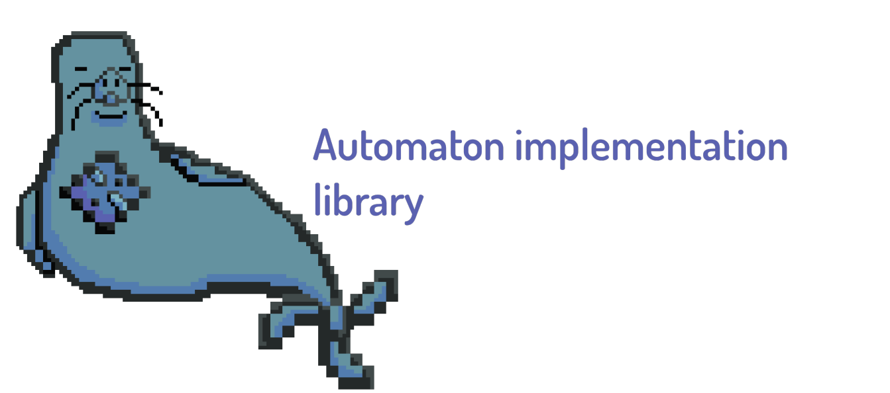
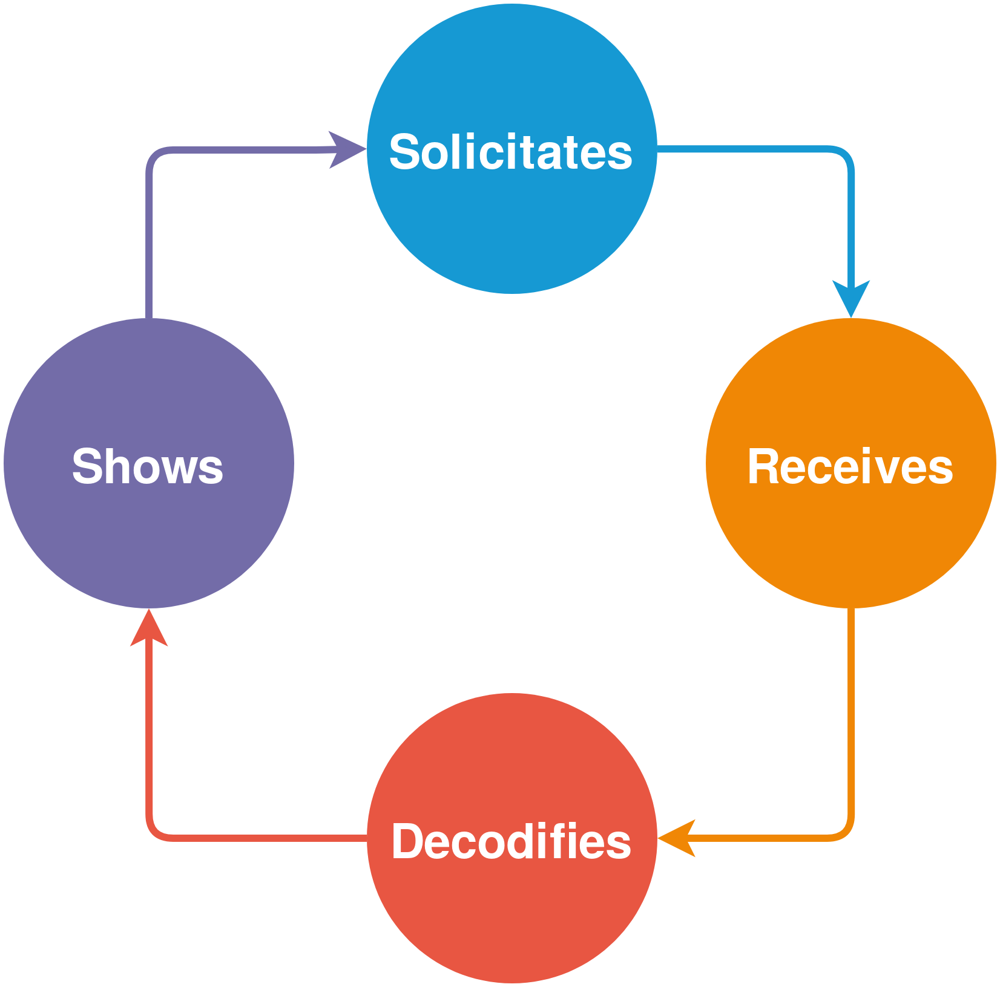

<h1 align="center">
    
</h1>

A simple automaton implementation library to the Java language.

* Model diverse kind of automatons with ihneriting the base State Machine implementation
* Create custom behaviours for your applications (ie: The flow of a bluetooth communication)
* Efficient execution in a dedicated thread for every action

# Requirements

None :D!

# Install process

We proporcionate this library in a **JAR file** so you just need to import it on your project. you should download the **last release** in the repository to obtain the **AutomatonMonkSeal.jar** first, then:

If you use **Netbeans** in example, you should:
* In the **Projects tab**, expand the project which you want to include _AutomatonMonkSeal_
* Right click on the **Libraries section** and select **Add JAR/Folder**
* Finally select the **JAR file** downloaded previously

If you use **Android Studio**, you should:
*  In Android Studio go to **File** >> **Project Structure**
* Then click on the **+** icon, next selects **Import .JAR/.AAR Package**
* Finally in your **build.gradle (at module level)** add the line **implementation project(':AutomatonMonkSeal')** to the dependencies

# Usage

See the [example app](https://github.com/AlfonsoBarragan/eMOVI) that use this kind of simple automaton to model complex bluetooth communications.

Another example of how to use this library, suppose that we got the next problem:

We got a mobile app that communicates with a custom bluetooth device, this device send 300 samples in bytes and we want to 
show the values in a legible human format.

So we think that an automaton like this can help to perfom this task:

<h3 align="center">
    
</h3>

To implementate this automaton we should code like this:

## Import the library objects in the project

```java
import AutomatonMonkSeal.StateMachineBase;
import AutomatonMonkSeal.StateBase;
import AutomatonMonkSeal.TransitionBase;
```

## Create the runnables of enter, exit and end_state of every state

```java
        Runnable entr_state_sol = () -> {
            System.out.println("ENTER IN STATE SOLICITATES");
            solicitate_data(BluetoothDevice ble);
        };

        Runnable exit_state_sol = () -> {
            System.out.println("EXIT OF STATE SOLICITATES");
        };

        
        Runnable end_state_sol = () -> {
            System.out.println("LAST STATE WAS SOLICITATES");
        };
```

## Create the transitions of the automaton

```java
        TransitionBase sol_to_rec = new TransitionBase("go to rec", "SOL", "REC");
        TransitionBase rec_to_dec = new TransitionBase("go to dec", "REC", "DEC");
        TransitionBase dec_to_sho = new TransitionBase("go to sho", "DEC", "SHO");
        TransitionBase sho_to_sol = new TransitionBase("go to sol", "SHO", "SOL");
```

## Create the states machine, add every state and add the transitions

```java
        StateMachineBase smb = new StateMachineBase("DataBehaviour");

        smb.addState("SOL", entr_state_sol, exit_state_sol, end_state_sol, true);
        smb.addState("REC", entr_state_rec, exit_state_rec, end_state_rec, false);
        smb.addState("DEC", entr_state_dec, exit_state_dec, end_state_dec, false);
        smb.addState("SHO", entr_state_sho, exit_state_sho, end_state_sho, false);

        smb.addTransition(sol_to_rec);
        smb.addTransition(rec_to_dec);
        smb.addTransition(dec_to_sho);
        smb.addTransition(sho_to_sol);
```

## Then run the init the automaton with the addEvent method

```java
    smb.addEvent("go to rec");
```

### Full example [file](/resources/examples/DummyProjectAutomaton.java) to test

```java
        Runnable entr_state_sol = () -> {
            System.out.println("ENTER IN STATE SOLICITATES");
        };
        
        
        Runnable entr_state_rec = () -> {
            System.out.println("ENTER IN STATE RECEIVES");

        };
        
        
        Runnable entr_state_dec = () -> {
            System.out.println("ENTER IN STATE DECODIFIES");
            
        };
        
        
        Runnable entr_state_sho = () -> {
            System.out.println("ENTER IN STATE SHOW");

        };
        
                
        Runnable exit_state_sol = () -> {
            System.out.println("EXIT OF STATE SOLICITATES");
        };
        
        
        Runnable exit_state_rec = () -> {
            System.out.println("EXIT OF STATE RECEIVES");
        };
        
        
        Runnable exit_state_dec = () -> {
            System.out.println("EXIT OF STATE DECODIFIES");
        };
        
        
        Runnable exit_state_sho = () -> {
            System.out.println("EXIT OF STATE SHOW");
        };
        
                
        Runnable end_state_sol = () -> {
            System.out.println("END STATE WAS SOLICITATES");
        };
        
        
        Runnable end_state_rec = () -> {
            System.out.println("END STATE WAS RECEIVES");
        };
        
        
        Runnable end_state_dec = () -> {
            System.out.println("END STATE WAS DECODIFIES");
        };
        
        
        Runnable end_state_sho = () -> {
            System.out.println("END STATE WAS SHOW");
        };
        
        TransitionBase sol_to_rec = new TransitionBase("go to rec", "SOL", "REC");
        TransitionBase rec_to_dec = new TransitionBase("go to dec", "REC", "DEC");
        TransitionBase dec_to_sho = new TransitionBase("go to sho", "DEC", "SHO");
        TransitionBase sho_to_sol = new TransitionBase("go to sol", "SHO", "SOL");
        
        StateMachineBase smb = new StateMachineBase("DataBehaviour");

        smb.addState("SOL", entr_state_sol, exit_state_sol, end_state_sol, true);
        smb.addState("REC", entr_state_rec, exit_state_rec, end_state_rec, false);
        smb.addState("DEC", entr_state_dec, exit_state_dec, end_state_dec, false);
        smb.addState("SHO", entr_state_sho, exit_state_sho, end_state_sho, false);
        
        smb.addTransition(sol_to_rec);
        smb.addTransition(rec_to_dec);
        smb.addTransition(dec_to_sho);
        smb.addTransition(sho_to_sol);

        smb.addEvent("go to rec");
```


